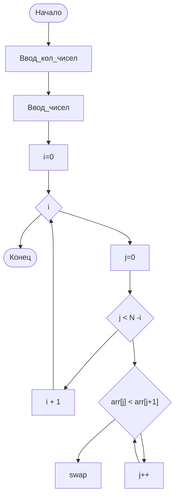
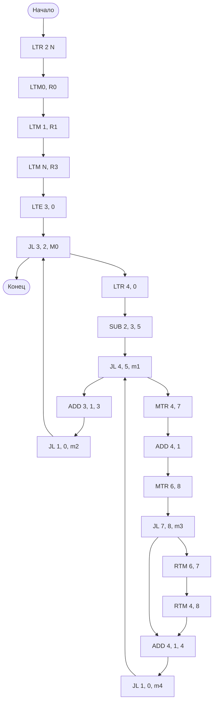

1. Архитектура системы [[Процессор|команд]] (Что такое процессор?)
2. Микроархитектура (Как программа исполняется?)

## Пример
Сортировка массива пузырьком
1. Адресность (Трехадресная)
2. Архитектура (Гарвардская)

Следовательно нужно:
- LTM - адрес в ячейке памяти; литерал
- LTR - адрес регистра; литерал
- 15 регистров

| 0   | 0       |
| --- | ------- |
| 1   | 1       |
| 2   | N       |
| 3   | i       |
| 4   | возврат |
| 5   | N-i     |
| 6   | j+1     |

- JL - адрес регистра 1  операнда; адрес регистра второго операнда; адрес перехода прилжа
- SUB - адрес регистра 1 операнда; адрес регистра 2 операнда; адрес результата
- ADD (как SUB)
- MTR - адрес регистра source, адрес регистра dest (memory to register)
- RTM

и тогда:

