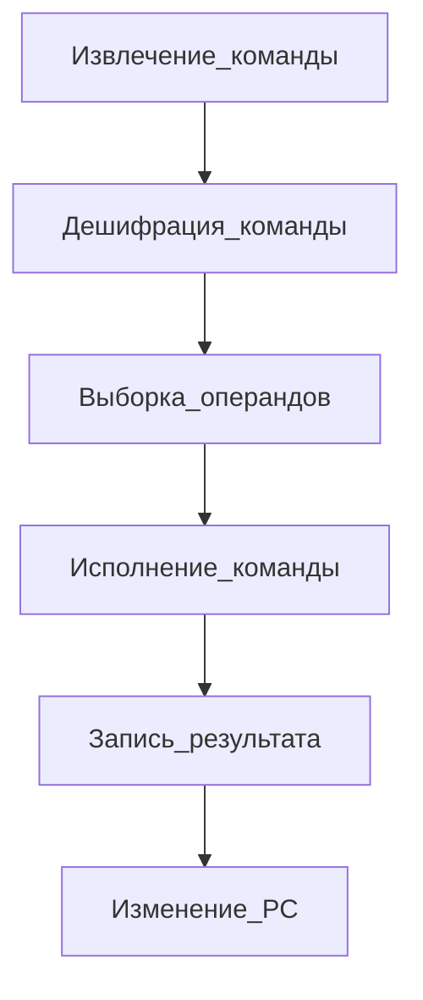

Триггер (b-стабильная ячейка)
Сейчас d-триггер популярен.

Конечный автомат - Мат.обстракция состоящая из:
А - множество входных данных
B - множество выходных данных
G - функция выхода 
S - множество состояний 
F - функция переходов 

## Процессорное ядро
Память(действия в двоичной последовательности) - память команд/данных 
Регистровый файл(РОН)
Счетчик команд
Регистр команд (считанная по счетчику команд кома)
АЛУ

## Команды
Последовательность бинарных чисел(машинное слово)

- Код операции (КОП) 
- Литерал (данные в команде)
- Адрес (данных, команды, перехода)

